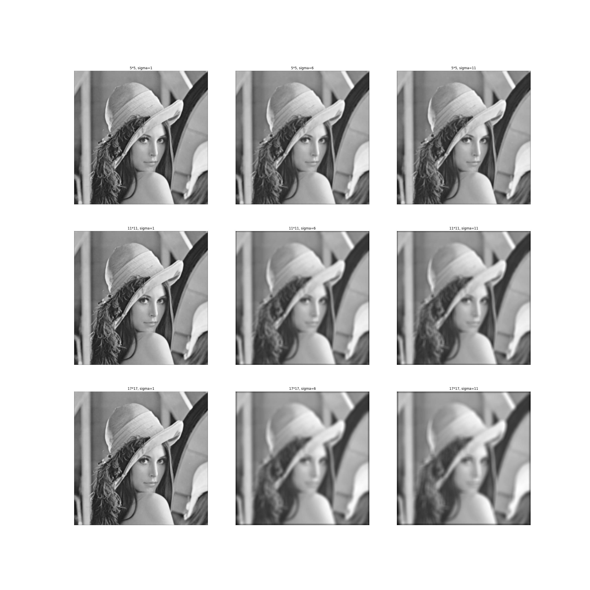
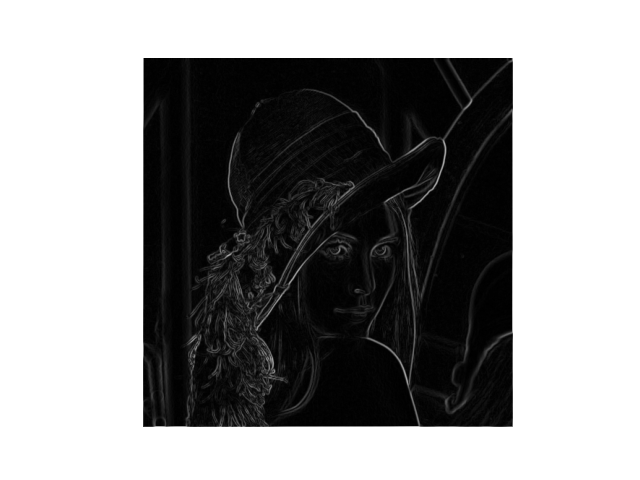
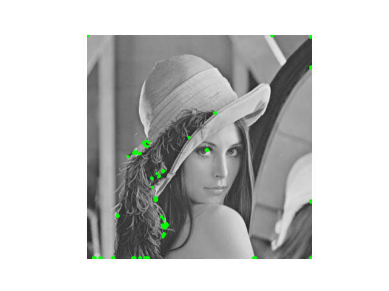

# OpenCV library implementation1
- implement OpenCV functions with Numpy
- make Gaussial Filter with implemented *get_gaussian_filter*
- apply filters with implemented *cross_correlation* using *padding*

## image filtering
- cross correlation calculation for 1D, 2D image
    - the function determine if kernel is horizontal or vertical
    - all kernel size is odd
    - size of the rusult == size of image by zero padding
- Gaussian Filter generator for 1D, 2D
    - get size, sigma as argument
    - return Gaussian Filter as result
    - Gaussian Filer size is odd
- Perform Gaussian filtering to *lenna.png* and *shapes.png* with 9 different filters
    - store the result as *../result/part_1_gaussian_filtered_xxxx*

## edge detection
- apply Gaussian Filter to images
- return image gradient
    - using **Sobel filter**, get magnitude and direction of gradient of each pixel.
    - store magnitude map as *../result/part_2_edge_raw_xxxx*

    -**NMS**
        - get gradient using Sobel filter
        - quantize direction to 8 values
        - compare magnitude along the quantized direction of the pixel
            - if the pixel value is max along three pixel in the direction, do nothing
            - else, suppress the pixel(set the magnitude of the pixel 0)
        - store magnitude map as *../result/part_2_edge_sup_xxxx* 

## corner detection
- apply Gaussian Filter to images
- apply Sobel filter
- get second moment matrix M
    - using 5 x 5 uniform window
    - κ = 0.04 for response function(R = λ<sub>1</sub>λ<sub>2</sub> - κ(λ<sub>1</sub> + λ<sub>2</sub>)<sup>2</sup>)
    - update negative respose to 0
    - normalize the response to range from 0 to 1
    - store corner response as *../result/part_3_corner_raw_xxxx*

- color the pixel whose corner response > threshold
    - store the result as *../result/part_3_corner_bin_xxxx*

- apply NMS
    - when the pixel is not maximum in squared window(11 x 11), suppress the pixel
    - if the pixel is maximum but less than threshold, suppress
    - color not suppressed pixel and store it as *../result/part_3_corner_sup_xxxx*

## File structure
```
|-- src
    |-- gaussian_filter.py // file that contains padding, cross_correlation, gaussian_filter functions to be used in other files
    |-- image_filtering.py
    |-- edge_detection.py
    |-- corner_detection.py
|-- images
    |-- lenna.png
    |-- shapes.png
|-- result
    |-- part_1_gaussian_filtered_lenna.png
    |-- part_1_gaussian_filtered_shapes.png
    |-- part_2_edge_raw_lenna.png
    |-- part_2_edge_raw_shapes.png
    |-- part_2_edge_sup_lenna.png
    |-- part_2_edge_sup_shapes.png
    |-- part_3_corner_bin_lenna.png
    |-- part_3_corner_bin_shapes.png
    |-- part_3_corner_raw_lenna.png
    |-- part_3_corner_raw_shapes.png
    |-- part_3_corner_sup_lenna.png
    |-- part_3_corner_sup_shapes.png
```

## Result
<p align=center>
    <br/>
    Gaussian filter
</p>
<p align=center>
    <br/>
    edge detection with NMS 
</p>
<p align=center>
    <br/>
    corner detection with NMS  
</p>

## 배운 점
- 이미지에 correlation을 통해 필터를 적용하는 방식을 배울 수 있었다.
- Sobel filter를 이용하여 image를 미분하고 미분값과 방향을 얻을 수 있었다.
- 미분한 값과 NMS를 바탕으로 pixel의 양쪽을 기준으로 값의 변화가 큰 edge를 찾아낼 수 있었다.
- 미분한 값rhk NMS를 바탕으로 pixel의 모든 측면에서 값의 변화가 큰 corner를 찾을 수 있었다.
- Numpy 사용이 능숙해졌다.

## 한계점
- corner detection에서 그림의 네 모서리도 corner로 detect 되는 현상이 있다. 이를 방지하기 위해 그림의 끝인 경우 제외하는 알고리즘을 적용해보았으나 소용이 없었다. 
